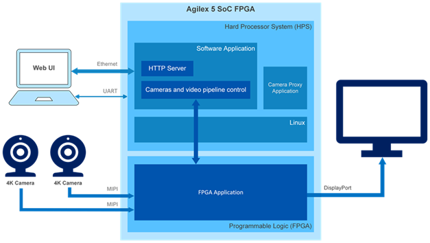

# Agilex 5 Camera 4Kp60 HDR
## One-Time Bring-up, Offline Customer Demo, and Build Guide

| Field | Value |
|---|---|
| Target design | 4Kp60 Multi-Sensor HDR Camera Solution System Example Design |
| Target hardware | Agilex 5 FPGA E-Series 065B Modular Development Kit |
| Default documentation release | 26.1 |
| Intended audience | Engineer bringing up the kit for the first time or demonstrating it to a customer |
| Primary use case | Run the pre-built image; build from source only when modification is required |

> This is an Altera example design. It is a development demonstration, not a production-qualified camera product.

---

## 1. What this design does

The design accepts one or two Framos FSM:GO IMX678 camera inputs over MIPI CSI-2, processes the images in the FPGA ISP pipeline, and drives 4Kp60 video over DisplayPort. Linux runs on the HPS and starts the application, camera control, and browser GUI.



*Figure 1. Official Altera high-level block diagram. Source: [26.1 camera 4K design guide](https://github.com/altera-fpga/agilex5-ed-camera/blob/rel/26.1/docs/es/camera/camera_4k/camera_4k.md).*

### Expected final result

1. The monitor connected to **Carrier DisplayPort TX** shows the ISP-processed camera output.
2. The HPS Linux console is available through the SOM UART USB connection.
3. A browser on the host PC opens `http://<board-ip>/` and displays the camera GUI.

---

## 2. Official links and downloads

### Run the pre-built design

| Purpose | Official link |
|---|---|
| 26.1 camera design overview | https://altera-fpga.github.io/rel-26.1/embedded-designs/agilex-5/e-series/modular/camera/camera_4k/camera_4k/ |
| Detailed 26.1 bring-up guide | https://github.com/altera-fpga/agilex5-ed-camera/blob/rel/26.1/docs/es/camera/camera_4k/camera_4k.md |
| 26.1 pre-built release assets | https://github.com/altera-fpga/agilex5-ed-camera/releases/tag/rel-26.1-isp_hdr-MDK_RevB_GrpB |
| 26.1 QSPI image (`top.core.jic`) | https://github.com/altera-fpga/agilex5-ed-camera/releases/download/rel-26.1-isp_hdr-MDK_RevB_GrpB/top.core.jic |
| 26.1 microSD image (`.wic.gz`) | https://github.com/altera-fpga/agilex5-ed-camera/releases/download/rel-26.1-isp_hdr-MDK_RevB_GrpB/hps-first-vvp-isp-demo-image-agilex5_mk_a5e065bb32aes1.wic.gz |
| 25.1 pre-built release assets (alternate test release) | https://github.com/altera-fpga/agilex5-ed-camera/releases/tag/rel-25.1 |
| Quartus Prime Pro 26.1 download | https://www.altera.com/downloads/fpga-development-tools/quartus-prime-pro-edition-design-software-version-26-1-linux |

### Build or modify the design

| Purpose | Official link |
|---|---|
| Camera design source repository, `rel/26.1` branch | https://github.com/altera-fpga/agilex5-ed-camera/tree/rel/26.1 |
| Hardware build / MDT guide | https://github.com/altera-fpga/agilex5-ed-camera/blob/rel/26.1/AGX_5E_Altera_Modular_Dk_ISP_designs/HDR_CAMERA.md |
| Modular Design Toolkit, `rel/26.1` | https://github.com/altera-fpga/modular-design-toolkit/tree/rel/26.1 |
| Software / Yocto build guide | https://github.com/altera-fpga/agilex5-ed-camera/blob/rel/26.1/sw/README.md |
| Git LFS installation | https://git-lfs.com/ |
| Yocto Project requirements | https://docs.yoctoproject.org/ref-manual/system-requirements.html |
| KAS installation and dependencies | https://kas.readthedocs.io/en/latest/userguide.html#dependencies-installation |
| VVP IP Suite | https://www.altera.com/products/ip/po-3150/video-and-vision-processing-suite |
| MIPI D-PHY / CSI-2 IP | https://www.altera.com/products/ip/po-3062/mipi-d-phy-ip |

---

## 3. Select the correct release pair

The FPGA/QSPI and Linux/microSD images must come from the **same release**.

| Do | Do not |
|---|---|
| Use 26.1 `top.core.jic` with the matching 26.1 `.wic.gz` image | Mix a 26.1 JIC with a 25.1 microSD image |
| Store release files in separate host folders | Rename files and lose release traceability |
| Record the release used on the kit | Assume a new microSD image works with existing QSPI contents |

For the default 26.1 pre-built flow, the two required files are:

```text
top.core.jic
hps-first-vvp-isp-demo-image-agilex5_mk_a5e065bb32aes1.wic.gz
```

---

## 4. Hardware and software checklist

### Hardware

| Item | Required |
|---|---|
| Agilex 5 E-Series 065B Modular Development Kit | Yes |
| Framos FSM:GO IMX678 camera module(s) and compatible lens | One or two |
| Framos MIPI cable for each camera | Yes |
| microSD card, 8 GB minimum | Yes |
| DisplayPort cable and 4K-capable monitor | Yes |
| Micro-USB cable for Carrier J35 (JTAG programming) | Yes for one-time QSPI programming |
| Micro-USB cable for SOM J2 (HPS serial console) | Yes |
| Ethernet cable for SOM J6 | Yes |
| Host PC running Linux or Windows | Yes |

### Host software

| Tool | Purpose |
|---|---|
| Quartus Prime Pro Programmer and Tools | Program the QSPI JIC |
| `minicom`, GtkTerm, PuTTY, or Tera Term | HPS serial console |
| Browser (Chrome, Edge, Firefox) | Camera GUI |
| `dd` (Linux) or an SD-card imaging tool | Write the microSD image |

> Work with the development kit, microSD card, and camera modules at an ESD-safe workstation.

---

## 5. One-time bring-up: program the kit from scratch

Use this section when the kit has no prepared microSD card and/or no matching QSPI image.

### 5.1 Prepare a local release folder

Download both files from the release page before starting. Keep them locally for offline bring-up later.

```bash
mkdir -p ~/agilex5-camera-26.1
cd ~/agilex5-camera-26.1

# Download from the official links in Section 2, then confirm both files exist.
ls -lh top.core.jic \
  hps-first-vvp-isp-demo-image-agilex5_mk_a5e065bb32aes1.wic.gz
```

Optional: create a local checksum record after download:

```bash
sha256sum top.core.jic \
  hps-first-vvp-isp-demo-image-agilex5_mk_a5e065bb32aes1.wic.gz \
  > release-file-sha256.txt
```

### 5.2 Create the bootable microSD card

The release image is a gzip-compressed disk image. Extract it:

```bash
cd ~/agilex5-camera-26.1
gunzip -k hps-first-vvp-isp-demo-image-agilex5_mk_a5e065bb32aes1.wic.gz
```

Insert the microSD card reader and identify the removable device:

```bash
lsblk
```

Use the **whole removable disk** (for example `/dev/sda`), not a partition such as `/dev/sda1`, and never the host system disk (often `nvme0n1`).

```bash
# Example only: replace /dev/sdX with the microSD device confirmed above.
sudo umount /dev/sdX1
sudo dd if=hps-first-vvp-isp-demo-image-agilex5_mk_a5e065bb32aes1.wic \
  of=/dev/sdX bs=1M status=progress conv=fsync
sync
sudo eject /dev/sdX
```

Power off the kit and insert the microSD card into the **SOM microSD slot**.

### 5.3 Program the QSPI flash

This is normally required only once for a chosen release.

1. Power the kit **off**.
2. Set the SOM **MSEL/S4 switch to OFF-OFF** (JTAG configuration mode).
3. Connect Carrier **J35** Micro-USB to the host PC.
4. Power the kit **on**.
5. Confirm JTAG is detected:

```bash
jtagconfig
```

6. Program the matching JIC:

```bash
cd ~/agilex5-camera-26.1
quartus_pgm -c 1 -m jtag -o "pvi;top.core.jic"
```

If `jtagconfig` lists a cable index other than `1`, replace `-c 1` with the listed index. Wait for the Programmer success message.

7. Power the kit **off**.
8. Set the SOM **MSEL/S4 switch to ON-ON** (AS×4 / QSPI boot mode).

### 5.4 Connect the final system

With the kit powered off:

1. Connect one or two cameras to the carrier MIPI connector(s), aligning **pin 1 to pin 1**.
2. Connect Carrier **DisplayPort TX** to the monitor.
3. Connect SOM **J2** to the host PC for the HPS serial console.
4. Connect SOM **J6** Ethernet to the same network as the host PC.
5. Power on the kit and wait about two minutes for Linux and the application to start.

---

## 6. Customer-facing offline bring-up

Use this section at a customer site where Internet access may be unavailable.

### 6.1 What to prepare before travelling

| Item | Offline requirement |
|---|---|
| Host laptop | Quartus Programmer, serial terminal, and browser already installed |
| Release folder | Matching `top.core.jic` and `.wic` image retained locally |
| Prepared microSD | Written and verified with the matching `.wic` image |
| Cables | J35 USB, J2 USB, J6 Ethernet, MIPI, and native DisplayPort |
| Monitor | Tested to accept 4Kp60 DisplayPort input |
| Network | Direct Ethernet cable to host or a local DHCP router/switch; Internet is not required |

### 6.2 First-time customer-site deployment

1. Check the microSD card is inserted in the SOM slot.
2. Power off the board and set **MSEL/S4 = OFF-OFF**.
3. Connect **J35** to the host, power on, and program the locally stored matching JIC:

```bash
cd ~/agilex5-camera-26.1
jtagconfig
quartus_pgm -c 1 -m jtag -o "pvi;top.core.jic"
```

4. When programming succeeds, power off and set **MSEL/S4 = ON-ON**.
5. Connect the camera(s), DisplayPort TX monitor, J2 USB serial, and J6 Ethernet.
6. Power on and continue with Section 6.4.

### 6.3 Repeat demo on a pre-provisioned kit

When matching QSPI and microSD are already installed, do **not** reprogram QSPI:

1. Confirm **MSEL/S4 = ON-ON**.
2. Insert the prepared microSD card.
3. Connect MIPI camera(s), DP TX monitor, J2 USB, and J6 Ethernet.
4. Power on and wait about two minutes.
5. Continue with Section 6.4.

### 6.4 Open the HPS terminal

The lab-confirmed command below opens the serial console in a separate terminal window:

```bash
gnome-terminal --title="Agilex-HPS-ttyUSB3" -- bash -c \
  "sudo minicom -D /dev/ttyUSB3 -b 115200; exec bash"
```

Serial settings:

```text
115200 baud, 8 data bits, 1 stop bit, no parity,
hardware flow control disabled, software flow control disabled
```

Press Enter. At the login prompt, enter:

```text
root
```

> `/dev/ttyUSB3` is the proven lab mapping, but Linux assigns ttyUSB numbers during USB enumeration. If it is blank or unavailable, run `ls -l /dev/ttyUSB*` and identify the serial ports added by **SOM J2**. The official guidance is to use the HPS UART port from that J2 group. If J35 is also connected, its serial ports may enumerate first.

### 6.5 Network without Internet access

The browser GUI works over local Ethernet; Internet access is not required after the design assets are prepared.

#### Option A: local router or switch with DHCP

Connect both the host and board J6 to the same local DHCP-capable router/switch. On the board:

```bash
ip -4 addr show eth0
```

Record the `eth0` address.

#### Option B: direct board J6 to Ubuntu host

On Ubuntu, configure the wired Ethernet connection as **Shared to other computers**:

```text
Settings → Network → Wired → IPv4 → Shared to other computers
```

Confirm the host obtains an address similar to:

```bash
ip -4 addr show enp3s0
# Expected example: 10.42.0.1/24
```

On the board, obtain the address:

```bash
ip -4 addr show eth0
```

If no IPv4 address appears, request a DHCP lease:

```bash
udhcpc -i eth0
ip -4 addr show eth0
```

> Keep the default Ethernet MTU of **1500**. The original board investigated in this lab had a physical size-dependent Ethernet fault; lowering MTU only hid the fault and made the GUI unreliable. A healthy board passes the test in Section 7 at MTU 1500.

### 6.6 Open the camera GUI

On the host:

```bash
BOARD_IP=<board-eth0-ip>
google-chrome-stable http://$BOARD_IP/
```

The browser should show the Altera splash screen, then the camera GUI.

---

## 7. Customer-demo acceptance test

Run this before a demonstration. It verifies the complete board-to-host Ethernet path at the standard MTU.

```bash
BOARD_IP=<board-eth0-ip>

ping -c 2 $BOARD_IP
ping -c 2 -M do -s 1472 $BOARD_IP
curl -sS --max-time 10 http://$BOARD_IP/ | wc -c
```

Pass criteria:

| Check | Expected result |
|---|---|
| Small ping | Two replies |
| Full-size ping | Two replies at payload size 1472 |
| HTTP download | Nonzero HTML byte count |
| Browser | Altera splash then responsive GUI |
| Monitor | Camera or test-pattern video on DisplayPort TX |

If the full-size ping fails or browser receives no HTML:

1. Keep MTU at 1500.
2. Try a known-good Ethernet cable.
3. Test against a second host PC.
4. If the failure follows the board, remove the board from demo use and open a board support case.

---

## 8. Camera and DisplayPort operation

### Select the camera

In the browser GUI:

```text
Input Config → Input Source → Camera
```

When using one camera on MIPI1 and video is missing, use the documented workaround:

```text
Camera → Input TPG → Camera
```

### Verify camera detection from HPS

```bash
grep -iE 'Found camera|Active input|GMSL' /tmp/vvp-isp-demo.log | head -n 30
```

Healthy log examples include:

```text
Found camera: FSM-IMX678. Enumerated as [Cam 0]
Active input: Camera 0
[Camera 0] new video standard: 3840x2160p @60 RGB 12 bit
```

### DisplayPort no-signal troubleshooting

1. Confirm cable is in carrier **DisplayPort TX**, not another connector.
2. Prefer a native DisplayPort cable. A DP-to-HDMI adapter must support 4Kp60.
3. In the GUI, select **Input TPG**. If a test pattern appears, DisplayPort works; switch back to **Camera**.
4. Reseat the DP cable, select the correct monitor input, and power-cycle the monitor if needed.

---

## 9. Build from source

Use this section only when hardware or software changes are required. For a customer demo, use pre-built assets from Section 2.

### 9.1 Choose a hardware build flow

| Flow | License/use case | Result |
|---|---|---|
| SOF MDT flow | OpenCore Plus evaluation, time-limited or JTAG-tethered evaluation | `.sof` |
| RBF MDT flow | Full IP licenses, turnkey microSD/QSPI deployment | `.rbf` + `.jic` |
| Pre-generated Quartus project | Explore implementation and reports | Quartus project |

The RBF/QSPI flow requires full licenses for VVP Suite, Tone Mapping Operator, Warp, and 3D LUT IP. MIPI D-PHY, MIPI CSI-2, and Nios V licenses are also required as documented by Altera.

### 9.2 Clone the source

Install Git LFS before cloning. The repository includes a submodule.

```bash
git clone -b rel/26.1 --recurse-submodules \
  https://github.com/altera-fpga/agilex5-ed-camera.git \
  agilex5-ed-camera
```

### 9.3 Create the hardware project with MDT

SOF / OpenCore Plus evaluation:

```bash
cd agilex5-ed-camera
quartus_sh -t ./modular-design-toolkit/scripts/create/create_shell.tcl \
  -proj_path <project-path> \
  -proj_name agilex5_modkit_vvpisp \
  -xml_path ./AGX_5E_Altera_Modular_Dk_ISP_designs/AGX_5E_Modular_Devkit_ISP_FF_RD.xml
```

RBF / fully licensed flow:

```bash
cd agilex5-ed-camera
quartus_sh -t ./modular-design-toolkit/scripts/create/create_shell.tcl \
  -proj_path <project-path> \
  -proj_name agilex5_modkit_vvpisp \
  -xml_path ./AGX_5E_Altera_Modular_Dk_ISP_designs/AGX_5E_Modular_Devkit_ISP_RD.xml
```

### 9.4 Build the hardware project

SOF / evaluation:

```bash
cd <project-path>/scripts
quartus_sh -t build_shell.tcl -update_ocs -full_compile -ff_post_agx5e
```

RBF / fully licensed:

```bash
cd <project-path>/scripts
quartus_sh -t build_shell.tcl -update_ocs -full_compile -hps_post_agx5e
```

Expected outputs:

| Flow | Output |
|---|---|
| SOF | `fsbl_agilex5_modkit_vvpisp_time_limited.sof` |
| RBF | `agilex5_modkit_vvpisp.hps_first.hps.jic` and `agilex5_modkit_vvpisp.hps_first.core.rbf` |

### 9.5 Build the Linux microSD image

The official software flow needs a Linux host (or Docker) with at least **70 GB** free storage and **32 GB** RAM.

For the fully licensed HPS-first design:

```bash
cd agilex5-ed-camera/sw
KAS_MACHINE=agilex5_mk_a5e065bb32aes1 kas build kas/agilex_camera.yml
```

For OpenCore Plus FPGA-first evaluation:

```bash
cd agilex5-ed-camera/sw
KAS_MACHINE=agilex5_mk_a5e065bb32aes1 kas build kas/agilex_camera_ff.yml
```

The generated `.wic.gz` appears under:

```text
build/tmp/deploy/images/agilex5_mk_a5e065bb32aes1/
```

If you build custom hardware, use a matching custom RBF/JIC and software image. Changing the hardware can cause the stock application image to fail.

---

## 10. Troubleshooting table

| Symptom | Likely cause | Action |
|---|---|---|
| No `/dev/ttyUSB*` | Board off or USB cable missing | Power on; connect SOM J2 |
| Serial terminal blank | Incorrect host serial device | Use the J2 UART group; try the known `ttyUSB3` mapping first |
| Only Nios banner visible | Connected to a non-HPS serial interface | Select the J2 HPS UART port |
| `eth0` has no IPv4 | No DHCP path | Enable host Ethernet sharing or connect a DHCP router/switch; run `udhcpc -i eth0` |
| Small ping works but full-size ping fails | Ethernet path/board fault | Keep MTU 1500; follow Section 7 board triage |
| Browser blank, local server works | Ethernet path not carrying full response | Run Section 7; do not lower MTU to hide packet loss |
| Camera detected but monitor blank | DisplayPort issue | Use Input TPG, check DP TX, cable, monitor input |
| Single MIPI1 camera has no video | Documented design issue | Toggle Camera → Input TPG → Camera |
| Wrong release booted | Mismatched JIC and microSD | Reflash matching release pair |

---

## 11. One-page customer-demo checklist

```text
BEFORE TRAVEL
[ ] Matching JIC and microSD image saved locally
[ ] microSD already written
[ ] Quartus Programmer + minicom installed
[ ] J35, J2, J6, MIPI, and DP cables packed
[ ] Monitor accepts 4Kp60 DP

FIRST-TIME KIT PREPARATION
[ ] Power off; MSEL/S4 = OFF-OFF
[ ] J35 connected; power on
[ ] Program matching top.core.jic
[ ] Power off; MSEL/S4 = ON-ON
[ ] Insert matching microSD

CUSTOMER DEMO
[ ] Connect camera(s), DP TX monitor, J2 serial, J6 Ethernet
[ ] Power on; wait about 2 minutes
[ ] Open HPS terminal:
    gnome-terminal --title="Agilex-HPS-ttyUSB3" -- bash -c \
      "sudo minicom -D /dev/ttyUSB3 -b 115200; exec bash"
[ ] Login: root
[ ] Run: ip -4 addr show eth0
[ ] Browser: http://<board-ip>/
[ ] GUI: Input Config → Input Source → Camera
[ ] Confirm 1472-byte ping before demo
```

---

## 12. Revision history

| Version | Change |
|---|---|
| 1.0 | Initial standalone one-time bring-up, offline demo, and build guide |

